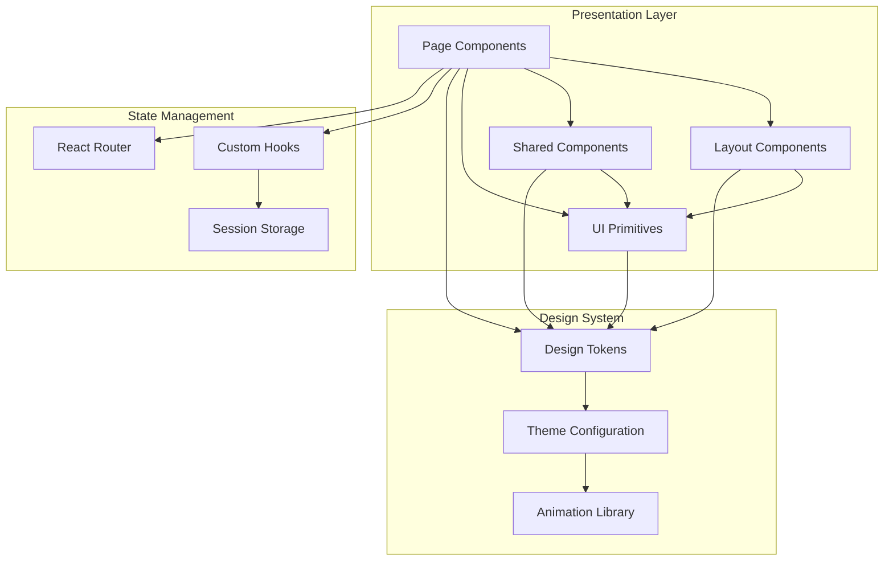

# Design Document: Teka Nga UI/UX Enhancement

## Overview

This design document outlines the comprehensive enhancement of the Teka Nga fact-checker application to match the provided Figma design mockups. The enhancement focuses on elevating the visual design, improving information hierarchy, adding polish animations, and ensuring consistent design patterns across all pages while maintaining the existing React + TypeScript + TailwindCSS architecture.

The redesign transforms Teka Nga from a functional MVP into a polished, production-ready Filipino fact-checking platform with professional visual design, enhanced usability, and delightful micro-interactions.

**Current State:**
- Basic functional implementation with minimal styling
- Inconsistent spacing and typography
- Missing visual polish and brand personality
- Limited use of the Teka mascot character

**Target State:**
- Fully branded experience matching Figma mockups pixel-perfect
- Consistent design system with defined tokens
- Polished animations and micro-interactions
- Enhanced information hierarchy and readability
- Mascot-driven personality throughout the experience

## Architecture


### System Architecture Diagram



### Component Hierarchy

The UI enhancement follows a strict component hierarchy:

1. **Page Level** - Full-page layouts (HomePage, AboutPage, VerifyPage, HistoryPage, ResultPage)
2. **Layout Level** - Structural components (Navbar, Footer, MobileBottomNav, PageContainer)
3. **Shared Level** - Reusable feature components (VerdictBadge, StatCard, ClaimRow, FeatureCard)
4. **UI Primitives** - Base components (Button, Card, Badge, Input, Textarea, Dialog, Tabs)
5. **Design Tokens** - CSS variables and Tailwind theme extensions

## Design System

### Color Palette

```typescript
// Primary Colors
const PRIMARY_BLUE = "#2B5FED"      // Main brand color, CTA buttons, links
const PRIMARY_BLUE_DARK = "#1a56db" // Hover states
const PRIMARY_BLUE_LIGHT = "#eff6ff" // Backgrounds
const PRIMARY_BLUE_BORDER = "rgba(43, 95, 237, 0.12)" // Subtle borders

// Accent Color
const ACCENT_YELLOW = "#FFC629"     // Highlights, "Teka Nga" text, badges
const ACCENT_YELLOW_DARK = "#fbbf24"
const ACCENT_YELLOW_LIGHT = "#fef3c7"

// Status/Verdict Colors
const VERDICT_TRUE = "#10b981"       // Emerald - true claims
const VERDICT_FALSE = "#ef4444"      // Red - false claims
const VERDICT_MISLEADING = "#f59e0b" // Amber - misleading claims
const VERDICT_UNVERIFIED = "#94a3b8" // Slate - unverified claims

// Neutral Colors
const BACKGROUND_WHITE = "#ffffff"
const FOREGROUND_SLATE = "#0f172a"   // Primary text
const MUTED_SLATE = "#64748b"        // Secondary text
const BORDER_GRAY = "#e2e8f0"        // Default borders
const CARD_BACKGROUND = "#f8faff"    // Subtle blue tint

// Gradient Overlays
const HERO_GRADIENT = "linear-gradient(135deg, #2B5FED 0%, #1a56db 100%)"
const DOT_GRID_OVERLAY = "radial-gradient(circle, rgba(255,255,255,0.15) 1.5px, transparent 1.5px)"
```

### Typography System

```typescript
// Font Family
const FONT_FAMILY = "Inter, -apple-system, BlinkMacSystemFont, 'Segoe UI', sans-serif"

// Font Sizes
const TEXT_SCALE = {
  '3xs': '0.625rem',  // 10px - small labels, tags
  '2xs': '0.6875rem', // 11px - metadata, fine print
  'xs': '0.75rem',    // 12px - body small, captions
  'sm': '0.875rem',   // 14px - body text, descriptions
  'base': '1rem',     // 16px - body large, inputs
  'lg': '1.125rem',   // 18px - section subtitles
  'xl': '1.25rem',    // 20px - card titles
  '2xl': '1.5rem',    // 24px - section headings
  '3xl': '1.875rem',  // 30px - page titles (mobile)
  '4xl': '2.25rem',   // 36px - page titles (desktop)
  '5xl': '3rem',      // 48px - hero headlines
}

// Font Weights
const FONT_WEIGHTS = {
  normal: 400,   // Body text, descriptions
  medium: 500,   // Emphasized text
  semibold: 600, // Subheadings
  bold: 700,     // Buttons, labels
  black: 900,    // Headlines, numbers
}

// Line Heights
const LINE_HEIGHTS = {
  tight: 1.25,   // Headlines
  snug: 1.375,   // Subheadings
  normal: 1.5,   // Body text
  relaxed: 1.625 // Descriptions
}
```

### Spacing System

```typescript
// Based on 4px base unit
const SPACING = {
  '0': '0',
  'px': '1px',
  '0.5': '0.125rem',  // 2px
  '1': '0.25rem',     // 4px
  '1.5': '0.375rem',  // 6px
  '2': '0.5rem',      // 8px
  '2.5': '0.625rem',  // 10px
  '3': '0.75rem',     // 12px
  '3.5': '0.875rem',  // 14px
  '4': '1rem',        // 16px
  '5': '1.25rem',     // 20px
  '6': '1.5rem',      // 24px
  '7': '1.75rem',     // 28px
  '8': '2rem',        // 32px
  '10': '2.5rem',     // 40px
  '12': '3rem',       // 48px
  '14': '3.5rem',     // 56px
  '16': '4rem',       // 64px
  '20': '5rem',       // 80px
}
```

### Border Radius System

```typescript
const RADIUS = {
  'sm': '0.5rem',    // 8px - small badges, pills
  'md': '0.625rem',  // 10px - inputs, small cards
  'lg': '0.75rem',   // 12px - default cards
  'xl': '1rem',      // 16px - large cards, modals
  '2xl': '1.25rem',  // 20px - hero cards
  'full': '9999px',  // Pills, circular avatars
}
```

### Shadow System

```typescript
const SHADOWS = {
  'sm': '0 1px 2px 0 rgba(0, 0, 0, 0.05)',
  'DEFAULT': '0 1px 3px 0 rgba(0, 0, 0, 0.1), 0 1px 2px -1px rgba(0, 0, 0, 0.1)',
  'md': '0 4px 6px -1px rgba(0, 0, 0, 0.1), 0 2px 4px -2px rgba(0, 0, 0, 0.1)',
  'lg': '0 10px 15px -3px rgba(0, 0, 0, 0.1), 0 4px 6px -4px rgba(0, 0, 0, 0.1)',
  'xl': '0 20px 25px -5px rgba(0, 0, 0, 0.1), 0 8px 10px -6px rgba(0, 0, 0, 0.1)',
  '2xl': '0 25px 50px -12px rgba(0, 0, 0, 0.25)',
  'inner': 'inset 0 2px 4px 0 rgba(0, 0, 0, 0.05)',
}
```

## Core Components

### New Components to Create

#### 1. StatCard Component

```typescript
interface StatCardProps {
  verdict: Verdict
  count: number
  size?: 'sm' | 'md' | 'lg'
}

// Visual specifications:
// - Rounded-lg border with verdict-specific color
// - Verdict-specific background (50 opacity)
// - Large bold number in verdict color
// - Small label text below
```

#### 2. CategoryPill Component

```typescript
interface CategoryPillProps {
  label: string
  variant?: 'default' | 'interactive'
  selected?: boolean
  onClick?: () => void
}

// Visual specifications:
// - Rounded-full shape
// - Primary color background at 10% opacity
// - Primary color text, bold, 10px font
// - Interactive variant adds hover states
```

#### 3. ProcessStepCard Component

```typescript
interface ProcessStepCardProps {
  number: string // "01" to "06"
  title: string
  description: ReactNode
}

// Visual specifications:
// - Rounded-xl border card
// - Large number in muted color (opacity 30%)
// - Bold title text
// - Description with inline highlights
// - Hover shadow transition
```

#### 4. TeamMemberCard Component

```typescript
interface TeamMemberCardProps {
  initials: string
  name: string
  role: string
  color: string // Tailwind color class
}

// Visual specifications:
// - Rounded-xl border card
// - Colored square badge with initials
// - Name and role stacked below
// - Centered layout
```

#### 5. FeatureCard Component

```typescript
interface FeatureCardProps {
  icon: LucideIcon
  title: string
  description: ReactNode
}

// Visual specifications:
// - Rounded-xl border card with padding
// - Icon container (primary background, 10% opacity)
// - Bold title
// - Description with inline highlights
// - Hover shadow transition
```

#### 6. ClaimRow Component (Enhanced)

```typescript
interface ClaimRowProps {
  claim: string
  date: string
  category: string
  verdict: Verdict
  confidence: number
  highlight?: string
  onClick: () => void
}

// Visual specifications:
// - Full-width button with left alignment
// - Claim text with optional bold highlighting
// - Date and category pill below claim
// - Confidence + verdict badge on right
// - Border-bottom separator (except last)
// - Hover background transition
```

#### 7. MascotCard Component

```typescript
interface MascotCardProps {
  size?: 'sm' | 'md' | 'lg'
  showGreeting?: boolean
  className?: string
}

// Visual specifications:
// - Mascot image with drop-shadow
// - Optional greeting callout
// - Configurable sizing
```

#### 8. TipsCard Component

```typescript
interface TipsCardProps {
  tips: string[]
}

// Visual specifications:
// - Amber background (bg-amber-50)
// - Amber border (border-amber-200)
// - Star emoji + "Mga Tips" header
// - Bullet list with amber dot indicators
```

#### 9. ExampleClaimCard Component

```typescript
interface ExampleClaimCardProps {
  claim: string
  category: string
  onClick: () => void
  disabled?: boolean
}

// Visual specifications:
// - White card with border
// - Claim text in primary color, semibold
// - Category below in muted text
// - Hover border color change
```

## Page-by-Page Specifications

### 1. Home Page

#### Layout Structure

```
┌─────────────────────────────────────────┐
│           Hero Section (Blue)           │
│  - Badge + Headline + Search            │
│  - Mascot (right side, desktop)         │
│  - Wave separator at bottom             │
└─────────────────────────────────────────┘
┌─────────────────────────────────────────┐
│        Features Section (White)          │
│  - "MGA TAMPOK" badge                    │
│  - "Bakit Teka Nga?" heading             │
│  - 4 feature cards in grid               │
└─────────────────────────────────────────┘
┌─────────────────────────────────────────┐
│     Recent Checks Section (White)        │
│  - Heading + "Tingnan Lahat" link        │
│  - Bordered card with claim rows         │
└─────────────────────────────────────────┘
┌─────────────────────────────────────────┐
│          CTA Section (Blue)              │
│  - Mascot + Heading + Description        │
│  - Yellow "Magsimula Na" button          │
└─────────────────────────────────────────┘
```

#### Hero Section Specifications

- **Background**: Primary blue gradient with dot-grid overlay
- **Wave Separator**: SVG wave at bottom, fills white
- **Badge**: Pill-shaped, white border (30% opacity), white bg (15% opacity), amber dot indicator
- **Headline**: 
  - Mobile: text-3xl (30px)
  - Desktop: text-5xl (48px)
  - "Teka Nga muna" in accent yellow
  - Font-weight: 900 (black)
- **Search Bar**:
  - Full-width white rounded-full input
  - Blue "Suriin" button with search icon
  - Shadow-xl elevation
- **Example Pills**:
  - "Halimbawa:" label
  - Bordered pills with white background (10% opacity)
  - Truncated text with ellipsis
- **Mascot** (Desktop only):
  - 208px × 208px (h-52 w-52)
  - Drop-shadow-2xl
  - "Kumusta? Ako si Teka!" below
  - Subtitle in smaller text

#### Features Section Specifications


- **Badge**: "MGA TAMPOK" - uppercase, primary bg (10% opacity), tracking-widest
- **Heading**: "Bakit Teka Nga?" - text-3xl/4xl, font-black
- **Grid**: 
  - Mobile: 2 columns
  - Desktop: 4 columns
  - Gap: 3-4 (12-16px)
- **Feature Cards**:
  - Rounded-xl/2xl borders
  - White background
  - Icon container: 40px × 40px, primary bg (10% opacity)
  - Title: text-sm, font-black
  - Description: text-xs with inline primary colored highlights

#### Recent Checks Section Specifications

- **Header Row**:
  - Left: Heading + subtitle
  - Right: "Tingnan Lahat" link with ChevronRight icon
- **Container**: Rounded-2xl bordered card
- **Claim Rows**:
  - Uses ClaimRow component
  - Border-bottom separator (except last)
  - Hover background (muted/40)
  - Date + CategoryPill on left
  - Confidence % + VerdictBadge on right

#### CTA Section Specifications

- **Background**: Primary blue solid
- **Layout**: Centered column
- **Mascot**: 64px × 64px (h-16 w-16), opacity-90
- **Heading**: text-3xl/4xl, white, font-black, max-w-lg
- **Description**: text-sm, white/75 opacity, max-w-sm
- **Button**: Accent yellow variant, size-lg, "Magsimula Na" with ArrowRight icon

### 2. About Page

#### Layout Structure

```
┌─────────────────────────────────────────┐
│           Hero Section                   │
│  - Mascot (80-96px)                      │
│  - "Tungkol sa Teka Nga" heading         │
│  - Description with inline highlights    │
└─────────────────────────────────────────┘
┌─────────────────────────────────────────┐
│      Mission/Vision Cards                │
│  - Blue card (left): Shield icon         │
│  - Amber card (right): TrendingUp icon   │
└─────────────────────────────────────────┘
┌─────────────────────────────────────────┐
│       Process Section (6 steps)          │
│  - "Paano Namin Sinusuri" heading        │
│  - 2×3 or 3×2 grid of numbered cards     │
└─────────────────────────────────────────┘
┌─────────────────────────────────────────┐
│         Team Section                     │
│  - "Ang Aming Koponan" heading           │
│  - 2×3 or 3×2 grid of member cards       │
└─────────────────────────────────────────┘
┌─────────────────────────────────────────┐
│        Partners Section                  │
│  - "Mga Kasosyo" heading                 │
│  - 2×4 or 4×2 grid of partner pills      │
└─────────────────────────────────────────┘
┌─────────────────────────────────────────┐
│         Awards Section (Blue)            │
│  - Medal icon + "Mga Parangal" heading   │
│  - 3 award cards with trophy icons       │
└─────────────────────────────────────────┘
```

#### Mission/Vision Cards

- **Mission Card**:
  - Background: Primary blue solid
  - Text: White
  - Icon: ShieldCheck, white/80 opacity
  - Title: "Aming Misyon", text-lg, font-black
  - Content: text-sm, white/85 opacity
- **Vision Card**:
  - Background: Amber-50
  - Border: Amber-200
  - Icon: TrendingUp, amber-500
  - Title: "Aming Bisyon", text-lg, font-black
  - Content: text-sm with primary highlights

#### Process Section

- **Grid**: 2×3 (mobile), 3×2 (desktop)
- **Cards**: Uses ProcessStepCard component
- **Numbers**: "01" through "06", large, muted/30 opacity
- **Titles**: text-xs/sm, font-black
- **Descriptions**: text-xs with inline highlights


#### Team Section

- **Grid**: 2×3 (mobile), 3×2 (desktop)
- **Cards**: Uses TeamMemberCard component
- **Avatar Badges**: 56px × 56px (h-14 w-14), rounded-xl, colored backgrounds
- **Colors**: Blue, Cyan, Amber, Emerald, Violet, Orange
- **Layout**: Centered with name and role stacked

#### Partners Section

- **Grid**: 2×4 (mobile), 4×2 (desktop)
- **Pills**: Rounded-xl bordered cards with organization names
- **Hover**: Border changes to primary/40, background to primary/5

#### Awards Section

- **Background**: Primary blue with rounded-2xl
- **Header**: Medal icon (accent color) + heading (white)
- **Grid**: 3 columns
- **Award Cards**: 
  - Background: white/10
  - Icon: Award, accent color
  - Title: text-sm, font-black, white
  - Organization: text-xs, white/70

### 3. Verify Page

#### Layout Structure

```
┌─────────────────────────────────────────┐
│           Page Header                    │
│  - Search icon in primary bg square      │
│  - "I-Verify ang Claim" heading          │
│  - Two-line description                  │
└─────────────────────────────────────────┘
┌──────────────────────┬──────────────────┐
│   LEFT COLUMN        │  RIGHT SIDEBAR   │
│                      │   (Desktop)      │
│   Card 1: Textarea   │                  │
│   (with char counter)│   Tips Card      │
│                      │   (Amber bg)     │
│   Card 2: Upload     │                  │
│   (Drag & drop zone) │   Examples Card  │
│                      │   (White bg)     │
│   Card 3: Options    │                  │
│   - Category chips   │                  │
│   - Checkboxes       │                  │
│   - Submit button    │                  │
└──────────────────────┴──────────────────┘
```

#### Card 1: Claim Input

- **Container**: Rounded-lg bordered card with padding
- **Label**: "Ang Claim o Statement", text-sm, font-bold
- **Textarea**: 
  - 6 rows minimum
  - Resize-none
  - Placeholder text
  - Character counter (bottom-right, absolute)
- **Character Counter**: 
  - Shows "N/500"
  - Red when ≤50 remaining
  - Muted gray otherwise
- **Loading Overlay**: 
  - Covers card when pending
  - Spinning loader with search icon
  - Animated status messages

#### Card 2: Image Upload

- **Container**: Rounded-lg bordered card
- **Label**: "Mag-upload ng Larawan..." with "(opsyonal)" in muted
- **Drop Zone**:
  - Dashed border-2
  - ImagePlus icon (large, muted/40)
  - Two-line instructions
  - Drag-over state changes border to primary
- **Uploaded State**:
  - Grid of image thumbnails (16 × 16, h-16 w-16)
  - Remove button on hover (red circle with X)
  - Additional upload button if <3 images

#### Card 3: Options & Submit

- **Category Section**:
  - Label: "Kategorya" with "(opsyonal)"
  - Flex-wrap grid of category buttons
  - Selected state: primary bg, white text
  - Unselected: white bg, border, hover states
- **Checkboxes**:
  - Custom checkbox component
  - 3 options in a row with flex-wrap
  - 16px checkbox size with checkmark SVG
- **Submit Button**:
  - Full width
  - Primary blue background
  - "Suriin Ngayon" with Search icon
  - Loader icon when pending

#### Right Sidebar (Desktop Only)

- **Tips Card**:
  - Amber-50 background
  - Amber-200 border
  - Star emoji + "Mga Tips" header
  - Bullet list with amber dots
- **Examples Card**:
  - White background with border
  - "Subukan ang mga ito:" label
  - Each example is its own bordered sub-card
  - Primary text for claim, muted for category

### 4. History Page

#### Layout Structure

```
┌─────────────────────────────────────────┐
│           Page Header                    │
│  - "Kasaysayan ng Pagsusuri" heading     │
│  - Subtitle                              │
└─────────────────────────────────────────┘
┌─────────────────────────────────────────┐
│         Stat Cards Row (4 cards)         │
│  - Totoo (green)                         │
│  - Hindi Totoo (red)                     │
│  - Mapanlinlang (amber)                  │
│  - Hindi Ma-verify (slate)               │
└─────────────────────────────────────────┘
┌─────────────────────────────────────────┐
│       Search + Filter Chips              │
│  - Search input (left)                   │
│  - Category chips (scrollable)           │
└─────────────────────────────────────────┘
┌─────────────────────────────────────────┐
│         Claim List                       │
│  - Bordered container                    │
│  - ClaimRow components                   │
│  - Empty state if no results             │
└─────────────────────────────────────────┘
```

#### Stat Cards

- **Grid**: 2×2 (mobile), 4×1 (desktop)
- **Each Card**: Uses StatCard component
- **Layout**: Number (large, colored) above label (small, muted)
- **Colors**: Match verdict colors

#### Search & Filters

- **Search Input**:
  - Width: 288px (w-72) on desktop, full on mobile
  - Rounded-lg border
  - Search icon on left (absolute positioned)
  - Placeholder: "Hanapin ang claim..."
- **Filter Chips**:
  - Horizontally scrollable
  - Active: primary bg, white text, shadow
  - Inactive: white bg, border, hover states
  - Categories: Lahat, Pulitika, Kalusugan, etc.

#### Claim List

- **Container**: Rounded-lg bordered card
- **Rows**: Uses ClaimRow component
- **Empty State**:
  - Centered layout with Search icon
  - Message text
  - 16rem (py-16) vertical padding

### 5. Result Page (Existing - Minor Enhancements)

No major structural changes, but apply:
- Consistent card styling (rounded-xl/2xl)
- Typography adjustments to match design system
- Spacing tokens alignment
- Shadow elevation consistency

## Animation and Interaction Patterns

### Page Transitions

```typescript
