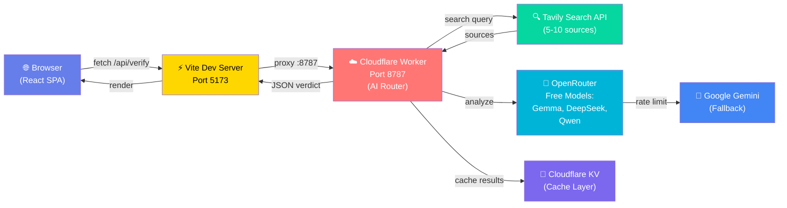

# Teka Muna — AI Fact-Checker

[](LICENSE)
[](https://nodejs.org/)
[](https://www.typescriptlang.org/)
[](https://react.dev/)
[](https://workers.cloudflare.com/)

> **Bago maniwala, Teka Muna.** *(Before you believe it, wait first.)*
>
> An open-source, AI-powered fact-checking platform built for every Filipino. Verify claims, news headlines, and viral posts in seconds with evidence-first analysis and transparent source credibility scoring.

**[Live Demo](https://tekamuna.app)** · **[Documentation](#documentation)** · **[API Reference](#api-reference)** · **[Contributing](#contributing)**

---

## Why Teka Muna?

Misinformation spreads fast. Teka Muna gives you independent, transparent fact-checks powered by AI evidence synthesis—not algorithms controlled by Big Tech. Built by Filipinos, for all Filipinos.

**Key Values:**
- 🔬 **Evidence-First** — Verdict determined by evidence, never source reputation alone
- 🤖 **AI-Native** — Harness free-tier AI models with intelligent fallback chains
- 📊 **Transparent** — See every source, credibility score, and AI reasoning
- 🇵🇭 **Filipino-First** — UI and responses in Filipino/Taglish
- 🔓 **Open Source** — Audit the code, fork it, improve it
- 💰 **Zero Cost** — Pure free-tier APIs (OpenRouter + Tavily + Gemini)

---

## ✨ Features at a Glance

| Feature | Description |
|---------|-------------|
| **AI Verdict** | Fact-checks any claim with `true / false / misleading / unverified` verdict + confidence score |
| **Evidence Pipeline** | Gathers 5–10 sources via Tavily, synthesizes with AI, weights credibility (doesn't skew verdict) |
| **Multi-Model Fallback** | Automatic switching between OpenRouter (Gemma/DeepSeek/Qwen) → Gemini when rate-limited |
| **Source Comparison** | Side-by-side source credibility scores, stance detection, link ranking |
| **Verification History** | Searchable, filterable history of all fact-checks (session-stored) |
| **Image Upload** | Extract claims from screenshots/photos via OCR + vision AI (beta) |
| **Responsive Design** | Mobile-first UI with TailwindCSS v4; works on any device |
| **Fast & Lean** | <100 KB gzipped; lazy-loaded routes; optimized Worker cold starts |

---

## 📋 Quick Start

### Prerequisites

- **Node.js** 18+ ([download](https://nodejs.org))
- **npm** 9+ (bundled with Node.js)
- **Wrangler CLI** (Cloudflare Workers CLI)
- **API Keys:** Tavily, OpenRouter, Gemini (all have free tiers)

### Clone & Install

```bash
git clone https://github.com/hanzodevelopment/teka-muna.git
cd teka-muna
npm install
```

### Set Up Environment Variables

```bash
cp .env.example .dev.vars
```

Edit `.dev.vars` with your keys:

```env
TAVILY_API_KEY=your-tavily-key
OPENROUTER_API_KEY=your-openrouter-primary-key
OPENROUTER_API_KEY_2=your-openrouter-secondary-key
GEMINI_API_KEY=your-gemini-key
```

See [Environment Variables](#environment-variables) for details on obtaining each key.

### Run Locally (Two Terminals)

**Terminal 1 — Cloudflare Worker:**
```bash
npx wrangler dev --port 8787
```

**Terminal 2 — React Frontend:**
```bash
npm run dev
```

Open **`http://localhost:5173`**. Vite automatically proxies `/api/*` to the Worker.

You should see the Teka Muna homepage. Try a fact-check!

---

## 🏗 Architecture

Teka Muna uses a serverless, edge-first architecture:



**Key Design Principles:**

1. **Evidence-First Verdict** — All sources passed to AI regardless of credibility; credibility only weights confidence, never changes verdict
2. **Intelligent Fallback Chain** — Primary: OpenRouter (free tier with dual keys) → Secondary: Gemini API
3. **Cost-Optimized** — Quota-exhausted results marked with `_persist: false` flag; skipped from cache to prevent database pollution
4. **Session-Scoped History** — Verification history stored in sessionStorage for privacy; no auth required
5. **Free-Only by Default** — Model config uses only `:free` tier models; paid tiers never auto-selected

**Full Architecture Docs:** → [docs/Architecture.md](docs/Architecture.md)

---

## 📦 Tech Stack

### Frontend (React SPA)

| Technology | Version | Purpose |
|------------|---------|---------|
| **React** | 18.2+ | Component UI framework |
| **TypeScript** | 5.0+ | Static type safety |
| **Vite** | 5.0+ | Build tool & dev server (ultra-fast HMR) |
| **TailwindCSS** | 4.0+ | Utility-first styling |
| **React Router** | 7.0+ | Client-side routing with lazy code-splitting |
| **TanStack Query** | 5.0+ | Async state management (caching, refetching) |
| **shadcn/ui** | Latest | Accessible UI component library |
| **Vercel Analytics** | Latest | Core Web Vitals tracking |

### Backend (Cloudflare Workers)

| Technology | Version | Purpose |
|------------|---------|---------|
| **Cloudflare Workers** | Latest | Serverless compute at the edge |
| **Cloudflare Pages** | Latest | Static assets + Worker integration |
| **Cloudflare KV** | Latest | Distributed key-value cache |
| **Wrangler CLI** | 3.0+ | Worker dev/deploy tooling |

### AI & Search APIs

| Service | Free Tier | Purpose |
|---------|-----------|---------|
| **OpenRouter** | 1000 req/day* | Access to free models: Gemma, DeepSeek, Qwen |
| **Gemini** | 60 req/min | Direct Google AI fallback |
| **Tavily** | 1000 calls/month | Web search + source credibility scoring |

*\*OpenRouter free tier: 1000 req/day with ≥$10 account credits; 50 req/day without credits*

---

## 🚀 Deployment

### Deploy to Cloudflare Pages

```bash
npm run build
wrangler pages deploy dist
```

Your site will be live at `https://<YOUR-PAGES-SUBDOMAIN>.pages.dev`.

### Configure Production Secrets

```bash
wrangler secret put OPENROUTER_API_KEY
wrangler secret put OPENROUTER_API_KEY_2
wrangler secret put GEMINI_API_KEY
wrangler secret put TAVILY_API_KEY
```

Verify deployment:
```bash
curl https://<YOUR-DOMAIN>/api/health
```

---

## 🔑 Environment Variables

### Local Development (`.dev.vars`)

```env
# Required
TAVILY_API_KEY=tvly-xxxxxxxxxxxxxxxxxxxxxxxxxxxxxxxx
OPENROUTER_API_KEY=sk-or-v1-xxxxxxxxxxxxxxxxxxxxxxxxxxxxxxxx

# Recommended
OPENROUTER_API_KEY_2=sk-or-v1-xxxxxxxxxxxxxxxxxxxxxxxxxxxxxxxx
GEMINI_API_KEY=AIzaSyxxxxxxxxxxxxxxxxxxxxxxxxxxxxxxxx

# Optional: Override model priorities (comma-separated OpenRouter model IDs)
# MODELS_VERDICT=deepseek/deepseek-chat:free,qwen/qwen3-32b:free
# MODELS_EVIDENCE_EXTRACTION=google/gemma-3-27b-it:free
```

### How to Get API Keys

**Tavily Search:**
1. Go to [tavily.com](https://tavily.com)
2. Sign up → Dashboard → Copy API Key
3. Free tier: 1000 calls/month

**OpenRouter:**
1. Go to [openrouter.ai](https://openrouter.ai)
2. Create account → [Get API Key](https://openrouter.ai/keys)
3. Free tier: 50 req/day (without credits) or 1000 req/day (with $10+ balance)
4. Recommended: Create two keys for fallback chain

**Gemini:**
1. Go to [Google AI Studio](https://aistudio.google.com/apikey)
2. "Create API Key" → Google Cloud Project
3. Free tier: 60 requests/minute

### Production Environment (Cloudflare Workers)

```bash
wrangler secret put TAVILY_API_KEY
wrangler secret put OPENROUTER_API_KEY
wrangler secret put OPENROUTER_API_KEY_2
wrangler secret put GEMINI_API_KEY
```

Secrets are encrypted and isolated per project.

---

## 📁 Project Structure

```
teka-muna/
├── src/                          # React Frontend
│   ├── main.tsx                  # React entry point + Analytics
│   ├── index.css                 # Global styles
│   ├── constants/index.ts        # App-wide constants (no magic strings!)
│   ├── types/                    # TypeScript interfaces
│   │   ├── index.ts              # Core types
│   │   ├── verify.ts             # Verdict & result types
│   │   ├── apiStats.ts           # API statistics
│   │   └── postTemplate.ts       # Template structures
│   ├── hooks/                    # React Query hooks
│   │   ├── useVerify.ts          # Fact-check query hook
│   │   └── useApiStats.ts        # Stats fetching hook
│   ├── services/                 # HTTP client + domain logic
│   │   ├── api.ts                # Base API client (all fetch calls here!)
│   │   ├── apiStats.ts           # Stats service
│   │   ├── historyService.ts     # Session history (sessionStorage)
│   │   └── shareCardService.ts   # Shareable card generation
│   ├── utils/                    # Pure utilities
│   │   ├── credibility.ts        # Credibility scoring logic
│   │   ├── claimExtractor.ts     # Extract claim from text
│   │   ├── intent.ts             # Intent detection
│   │   └── platforms/            # Platform-specific utilities
│   ├── lib/                      # Third-party wrappers
│   │   ├── utils.ts              # shadcn/ui (cn helper)
│   │   ├── supabase.ts           # Supabase client (if used)
│   │   └── storageUtils.ts       # Storage helpers
│   ├── components/               # React components
│   │   ├── layout/               # Page layout wrappers
│   │   ├── dashboard/            # Dashboard-specific components
│   │   ├── template-editor/      # Template builder components
│   │   ├── shared/               # Reusable components (Logo, Nav, Footer)
│   │   └── ui/                   # shadcn/ui primitives
│   ├── pages/                    # One file per route
│   │   ├── HomePage.tsx
│   │   ├── CheckPage.tsx         # Main fact-check page
│   │   ├── ResultPage.tsx        # Verdict display
│   │   ├── VerifyPage.tsx        # Claim input + OCR
│   │   ├── HistoryPage.tsx       # Session history
│   │   ├── DashboardPage.tsx
│   │   └── admin/
│   ├── providers/                # Context providers
│   │   ├── AuthProvider.tsx
│   │   └── QueryProvider.tsx     # TanStack Query setup
│   ├── router/index.tsx          # React Router configuration
│   ├── layouts/RootLayout.tsx    # Root wrapper component
│   └── assets/                   # Images, icons, fonts
│
├── worker/                       # Cloudflare Workers Backend
│   ├── index.ts                  # Worker entry point
│   ├── routes/                   # Route handlers
│   │   ├── verify.ts             # POST /api/verify (main fact-check)
│   │   ├── search.ts             # GET /api/search (raw web search)
│   │   ├── analyzeImage.ts       # POST /api/analyze-image (OCR + extraction)
│   │   ├── ocrExtract.ts         # POST /api/ocr-extract (text from image)
│   │   ├── stats.ts              # GET /api/stats (API usage)
│   │   ├── health.ts             # GET /api/health (provider config status)
│   │   └── postTemplates.ts      # Template management
│   ├── services/                 # Business logic
│   │   ├── gemini.ts             # AI verdict orchestration
│   │   ├── credibility.ts        # Credibility scoring
│   │   ├── EvidenceMerger.ts     # Merge sources into context
│   │   ├── EvidenceExtractor.ts  # Extract claims + evidence
│   │   ├── ImageAnalyser.ts      # Vision AI
│   │   ├── ocrSpace.ts           # OCR Space client
│   │   ├── tavily.ts             # Tavily search wrapper
│   │   ├── cache.ts              # KV cache layer
│   │   └── postTemplates.ts      # Template service
│   ├── ai/                       # AI Orchestration (AIManager)
│   │   ├── AIManager.ts          # Central AI router (all AI calls!)
│   │   ├── config/models.ts      # Model selection per task
│   │   ├── providers/            # AI provider wrappers
│   │   │   ├── OpenRouterProvider.ts
│   │   │   ├── OpenRouterVisionProvider.ts
│   │   │   ├── GeminiProvider.ts
│   │   │   └── (never call providers directly!)
│   │   └── types/                # AI-specific types
│   ├── lib/                      # Worker utilities
│   │   ├── adminSettings.ts
│   │   ├── apiLogger.ts          # API call logging
│   │   └── quotaFetcher.ts       # Check quota status
│   └── utils/                    # Pure utilities
│       ├── hostname.ts           # Domain detection
│       └── json.ts               # JSON utilities
│
├── docs/                         # Developer Documentation
│   ├── Architecture.md           # System design & data flow
│   ├── API.md                    # API endpoint reference
│   ├── CodingGuidelines.md       # Code style & patterns
│   ├── Components.md             # Component inventory
│   ├── Deployment.md             # Deploy to Cloudflare
│   ├── FolderStructure.md        # Detailed folder guide
│   ├── Hooks.md                  # React Query hooks
│   ├── Services.md               # Service layer reference
│   ├── UIDesign.md               # Design system
│   └── MY_LEARNING_GUIDE.md     # Onboarding guide
│
├── supabase/                     # Database migrations
│   └── migrations/
│       └── 20260801_post_templates.sql
│
├── public/                       # Static assets
│   └── logos/
│
├── functions/                    # Edge Functions (Supabase/Vercel)
│   └── _middleware.ts
│
├── api/                          # API utilities
│   └── check.ts
│
├── package.json                  # Dependencies & scripts
├── tsconfig.json                 # TypeScript config (root)
├── tsconfig.app.json             # TypeScript config (frontend)
├── tsconfig.node.json            # TypeScript config (build tools)
├── vite.config.ts                # Vite configuration
├── wrangler.toml                 # Cloudflare Workers config
├── eslint.config.js              # ESLint configuration
├── components.json               # Component library config
└── README.md                     # This file!
```

**Full Folder Reference:** → [docs/FolderStructure.md](docs/FolderStructure.md)

---

## 📚 Documentation

| Guide | Purpose |
|-------|---------|
| **[Architecture.md](docs/Architecture.md)** | System design, data flow, AI pipeline |
| **[API.md](docs/API.md)** | Endpoint reference, request/response formats |
| **[Getting Started](docs/MY_LEARNING_GUIDE.md)** | Onboarding guide for new developers |
| **[Coding Guidelines](docs/CodingGuidelines.md)** | Code style, patterns, best practices |
| **[Folder Structure](docs/FolderStructure.md)** | Detailed file organization reference |
| **[Components](docs/Components.md)** | UI component inventory |
| **[Hooks](docs/Hooks.md)** | React Query + custom hooks |
| **[Services](docs/Services.md)** | Service layer reference |
| **[UI Design](docs/UIDesign.md)** | Design system & Tailwind setup |

---

## 🎬 Run Locally (Detailed Steps)

### Step 1: Clone Repository

```bash
git clone https://github.com/hanzodevelopment/teka-muna.git
cd teka-muna
```

### Step 2: Install Dependencies

```bash
npm install
```

### Step 3: Create Local Environment File

```bash
cp .env.example .dev.vars
```

Open `.dev.vars` and fill in your API keys (see [Environment Variables](#environment-variables) above).

### Step 4: Start Both Servers

**In Terminal 1 (Cloudflare Worker):**
```bash
npx wrangler dev --port 8787
```

**In Terminal 2 (Vite Frontend):**
```bash
npm run dev
```

You'll see:
```
  VITE v5.x.x  ready in XXX ms

  ➜  Local:   http://localhost:5173/
  ➜  press h + enter to show help
```

### Step 5: Open in Browser

**Go to `http://localhost:5173`**

You should see the Teka Muna homepage and can start fact-checking!

### Troubleshooting

| Issue | Solution |
|-------|----------|
| Worker not starting | Ensure port 8787 is available (`netstat -an \| findstr 8787` on Windows) |
| CORS errors | Vite proxy should handle `/api/*` → Worker; check vite.config.ts |
| API calls 404 | Ensure Worker is running on port 8787 |
| TypeScript errors | Run `npm run lint` to check types; delete `dist/` and rebuild |

---

## 📜 Available Scripts

| Script | Description | Notes |
|--------|-------------|-------|
| `npm run dev` | Start Vite dev server (port 5173) | HMR enabled; watch mode |
| `npm run build` | Production build to `dist/` | Minified; tree-shaken |
| `npm run lint` | Run ESLint type checker | Catches errors before build |
| `npm run preview` | Preview production build locally | Simulates production behavior |
| `npx wrangler dev` | Start Cloudflare Worker (port 8787) | Local testing |
| `npx wrangler pages deploy dist` | Deploy to Cloudflare Pages production | Requires auth |

---

## 🔌 API Reference

### POST `/api/verify`

Fact-check a claim with AI verdict + evidence.

**Request:**
```json
{
  "claim": "The Earth is flat",
  "language": "en"
}
```

**Response (200):**
```json
{
  "verdict": "false",
  "confidence": 0.98,
  "reasoning": "Scientific evidence overwhelmingly demonstrates...",
  "sources": [
    {
      "title": "How We Know the Earth is Round",
      "url": "https://example.com",
      "credibility": 0.95,
      "stance": "supports_verdict"
    }
  ]
}
```

### GET `/api/search`

Raw web search results (no AI verdict).

**Query:**
```
GET /api/search?q=climate+change&limit=5
```

**Response (200):**
```json
{
  "query": "climate change",
  "results": [
    {
      "title": "...",
      "url": "...",
      "description": "..."
    }
  ]
}
```

### POST `/api/analyze-image`

Extract claim text from uploaded image via OCR.

**Request (multipart/form-data):**
```
file: <image.jpg> (max 1 MB)
```

**Response (200):**
```json
{
  "extractedText": "The extracted claim from the image",
  "confidence": 0.92
}
```

### GET `/api/health`

Check provider configuration status.

**Response (200):**
```json
{
  "status": "ok",
  "providers": {
    "openrouter": { "configured": true, "models": 5 },
    "gemini": { "configured": true },
    "tavily": { "configured": true }
  }
}
```

**Full API docs:** → [docs/API.md](docs/API.md)

---

## 💻 Coding Conventions

Follow these patterns to keep the codebase consistent and maintainable:

### Constants
- **All constants go in `src/constants/index.ts`**
- Never use magic strings in components
- Example:
  ```ts
  // constants/index.ts
  export const MASCOT_URL = 'https://example.com/mascot.png';
  export const STORAGE_KEY_HISTORY = 'teka_muna_history';
  
  // components/MyComponent.tsx
  import { MASCOT_URL } from '@/constants';
  
  ```

### API Calls
- **All fetch() calls in `src/services/api.ts`**
- Never fetch() directly in components
- Example:
  ```ts
  // services/api.ts
  export function verifyClaim(claim: string) {
    return fetch('/api/verify', { method: 'POST', body: JSON.stringify({ claim }) });
  }
  
  // components/VerifyForm.tsx
  import { verifyClaim } from '@/services/api';
  const result = await verifyClaim(claim);
  ```

### AI Calls
- **Always route through `worker/ai/AIManager.ts`**
- Never call providers directly
- AIManager handles fallback logic automatically

### Storage Access
- **Use `src/services/historyService.ts` for all sessionStorage**
- Centralizes storage logic; easier to migrate to localStorage/DB later

### AI Pipeline (Worker)
- **All analysis logic routed through `worker/services/gemini.ts`**
- Mark quota-exhausted results with `_persist: false` to skip caching
- Successful results auto-marked `_persist: true`

### File Headers
Every new file should have a JSDoc header:

```typescript
/**
 * Purpose: Brief description of what this file does
 * 
 * Responsibilities:
 * 1. Main responsibility 1
 * 2. Main responsibility 2
 * 
 * Dependencies:
 * - ./other-file.ts
 * - @package/name
 */
```

**Full Guidelines:** → [docs/CodingGuidelines.md](docs/CodingGuidelines.md)

---

## 🛣 Roadmap

### Current Status
- ✅ Core fact-checking pipeline (Tavily + AI verdict)
- ✅ Free-tier model cycling (OpenRouter → Gemini fallback)
- ✅ Session-scoped history
- ✅ Source credibility scoring
- ✅ Image upload with OCR (beta)
- ✅ Multilingual support (Filipino/English)
- ✅ Vercel Analytics integration

### Coming Next (Q1 2025)

- [ ] **Persistent User Accounts** — Migrate history from sessionStorage to user database
  - Link to GitHub/Google for auth
  - Export history as JSON/PDF
  - Sync across devices

- [ ] **Admin Dashboard** — For human fact-checkers to review & override AI verdicts
  - Queue of unreviewed claims
  - Evidence annotation interface
  - Verdict override with reasoning

- [ ] **Claim Sharing with Verification** — Shareable links that embed verdict
  - Unique claim URLs: `tekamuna.app/verify/abc123`
  - OpenGraph preview cards (custom thumbnail + verdict)
  - QR codes to share fact-checks

### Medium-Term (Q2–Q3 2025)

- [ ] **Multi-Phase Evidence Pipeline** — Split analysis into phases for deeper research
  - Phase 1: Quick web search → initial verdict
  - Phase 2: In-depth source clustering + cross-reference
  - Phase 3: Human expert review (optional premium)

- [ ] **Reverse Image Search** — Detect doctored/out-of-context images
  - Integration with Google Images + TinEye
  - EXIF metadata analysis
  - Deepfake detection (if model available)

- [ ] **Social Media Ingestion** — Auto-fact-check viral posts
  - Facebook/Twitter/TikTok integration
  - Automatic claim extraction from posts
  - Background fact-checking queue

- [ ] **PDF Upload** — Extract claims from documents
  - Multi-page PDF support
  - Tabular data extraction

### Future (Post-Q3 2025)

- [ ] Real-time misinformation tracking (trending false claims)
- [ ] Community fact-checking (upvote/flag verdicts)
- [ ] Browser extension for inline fact-checks
- [ ] AI-generated visual fact-check cards for sharing
- [ ] Integration with news organizations' CMS platforms

---

## 🤝 Contributing

We welcome contributions from the community! Whether you're fixing bugs, adding features, or improving docs, your help makes Teka Muna better.

### How to Contribute

1. **Fork the repository**
   ```bash
   git clone https://github.com/YOUR_USERNAME/teka-muna.git
   ```

2. **Create a feature branch**
   ```bash
   git checkout -b feat/amazing-feature
   ```

3. **Make your changes**
   - Follow the [Coding Guidelines](docs/CodingGuidelines.md)
   - Write clear commit messages
   - Ensure TypeScript passes: `npm run lint`

4. **Commit with conventional messages**
   ```bash
   git commit -m "feat: add amazing feature"
   git commit -m "fix: resolve issue #42"
   git commit -m "docs: update API reference"
   git commit -m "refactor: improve code quality"
   git commit -m "test: add unit tests"
   ```

5. **Push to your fork**
   ```bash
   git push origin feat/amazing-feature
   ```

6. **Open a Pull Request**
   - Link related issues
   - Describe what you changed and why
   - Ensure CI passes (TypeScript + ESLint)

### Contribution Ideas

- 🐛 **Bugs:** Check [Issues](https://github.com/hanzodevelopment/teka-muna/issues) for bugs labeled `bug`
- ✨ **Features:** Features labeled `enhancement` are great starting points
- 📚 **Documentation:** Help improve README, API docs, or guides
- 🇵🇭 **Translation:** Improve Filipino/Taglish strings
- 🎨 **UI/UX:** Suggest design improvements (submit screenshots)

### Code of Conduct

Be respectful, inclusive, and constructive. Harassment or discrimination is not tolerated. See [CODE_OF_CONDUCT.md](CODE_OF_CONDUCT.md).

---

## 📞 Support & Feedback

- **Report Bugs:** [GitHub Issues](https://github.com/hanzodevelopment/teka-muna/issues)
- **Feature Requests:** Open an issue with the `enhancement` label
- **Questions?** Check [docs/MY_LEARNING_GUIDE.md](docs/MY_LEARNING_GUIDE.md) or [FAQ](#faq)
- **Email:** hello@tekamuna.app *(to be added)*

---

## ❓ FAQ

**Q: Is Teka Muna free to use?**  
A: Yes! The web app is completely free. No paywalls, no premium tiers. We fund development through open-source sponsorships and grants.

**Q: Can I run Teka Muna offline?**  
A: The frontend works offline (cached), but fact-checking requires internet (for Tavily search + AI APIs).

**Q: What happens to my fact-check history?**  
A: History is stored in your browser's sessionStorage only. It's deleted when you close the tab. No server-side tracking (by design). We use Vercel Analytics only for anonymous page views.

**Q: Can I deploy Teka Muna to my own server?**  
A: Yes! The code is open-source. You'll need to set up your own Cloudflare Workers account and API keys (Tavily, OpenRouter, Gemini). See [Deployment](#-deployment).

**Q: How accurate are the AI verdicts?**  
A: Verdicts depend on evidence quality. We heavily weight evidence from credible sources (academic, journalistic), but no AI is perfect. **Always verify important claims independently.**

**Q: Can I use Teka Muna for my research project?**  
A: Yes, with attribution. See [LICENSE](#license).

---

## 📄 License

Teka Muna is released under the **ISC License**. You are free to:
- Use for personal or commercial projects
- Modify and distribute the code
- Use in proprietary projects (as long as you include a copy of the license)

You must:
- Include the original copyright notice

See [LICENSE](LICENSE) for full terms.

---

## 🎯 Project Goals

1. **Democratize fact-checking** — Make it free, fast, and accessible to all
2. **Combat misinformation** — Especially in the Philippines where false info spreads rapidly
3. **Build trust via transparency** — Show users the evidence and reasoning, not a black-box verdict
4. **Stay open-source** — Community-driven development; no corporate control
5. **Use only free AI** — Prove that powerful AI doesn't require expensive subscriptions

---

## 📊 Statistics

- **Frontend:** ~15 KB gzipped (React 18 + routing + TanStack Query)
- **Worker:** ~50 KB (AI orchestration + search + caching)
- **Time to First Byte:** <200 ms (edge) / <500 ms (search + AI)
- **Fact-Check Latency:** 3–8 seconds (Tavily search + AI reasoning)
- **API Quota:** 50–1000 requests/day (free tier, depends on OpenRouter credits)

---

## 🏆 Credits & Acknowledgments

Built with ❤️ by **Filipinos, for Filipinos.**

**Author:** [Hance Dagondon](https://github.com/hanzodevelopment)  
**Contributors:** [See GitHub Contributors](https://github.com/hanzodevelopment/teka-muna/contributors)

**Powered By:**
- 🤖 [OpenRouter](https://openrouter.ai) — Free AI model access
- 🔍 [Tavily AI](https://tavily.ai) — Web search research
- 🔮 [Google Gemini](https://gemini.google.com) — AI fallback
- ☁️ [Cloudflare Workers](https://workers.cloudflare.com) — Edge compute

---

## 💬 Follow Us

- **GitHub:** [@hanzodevelopment](https://github.com/hanzodevelopment)
- **Twitter/X:** [@tekamuna](https://x.com/tekamuna) *(to be added)*
- **Facebook:** [Teka Muna](https://facebook.com/tekamuna) *(to be added)*

---

<div align="center">

**Made with 🇵🇭 in the Philippines**

Bago maniwala, Teka Muna. *Before you believe it, wait first.*

[⬆ Back to Top](#teka-muna--ai-fact-checker)

</div>
